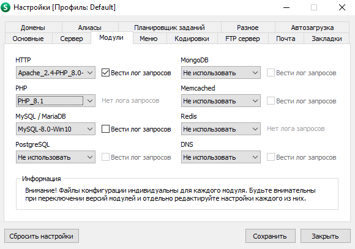
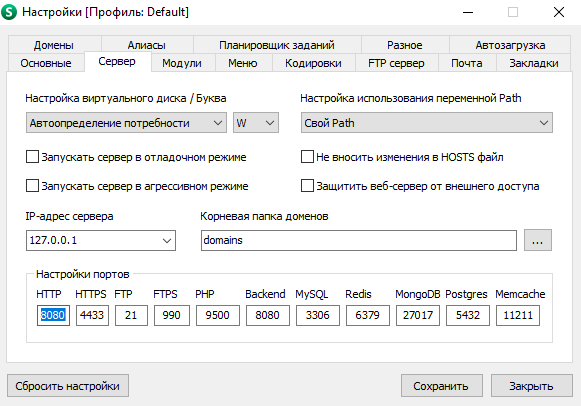

# Задание
 - cделать форму авторизации с выводом имени из формы
 - сделать форму регистрации с 5-7 полями

## Схема базы данных и дамп БД

Схема базы данных и дамg [здесь](/dump)

## Настройки OpenServer

- PHP 8.* (в райнем случае 7.4)
- MySql 8.0 или MariaDB 5.5+

### Если порт 8080 или 80 занят, меняем на любой дргуой     

## Основы PHP

[Методы строк](https://www.php.net/manual/ru/ref.strings.php)

[Методы массивов](https://www.php.net/manual/ru/ref.array.php)

[PDO (работа с БД)](https://metanit.com/php/mysql/2.4.php)

[Классы и объекты](https://www.php.net/manual/ru/language.oop5.php)

[Как сохранить файл](https://www.php.net/manual/ru/features.file-upload.post-method.php)

## Работа с GIT

[Мануал от atlassian](https://www.atlassian.com/ru/git)